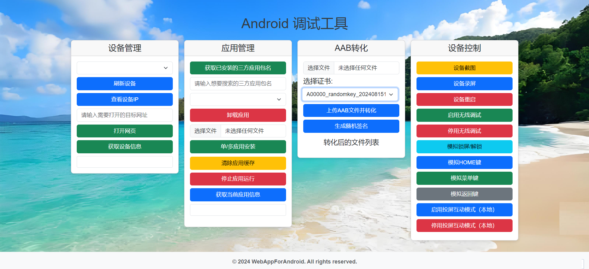

"# WebAppForAndroid" 

项目背景：

随着移动互联网的快速发展，Android操作系统因其开放性和灵活性，已经成为全球最流行的移动操作系统之一。然而，对于开发者、技术支持人员以及普通用户来说，Android设备的管理和调试仍然存在一定的复杂性。传统的ADB命令行工具虽然功能强大，但对于非技术用户并不友好，且在使用过程中可能存在操作风险。

为了简化Android设备的管理流程，提升用户体验，并为开发者提供更高效的调试工具，我们设计并实现了一个基于Web的Android设备管理与调试工具。本项目旨在通过现代Web技术，提供一个直观、易用的图形界面，让用户能够方便地执行操作，同时保持了足够的灵活性和扩展性，以适应不同用户群体的特定需求。

多设备支持：同时管理和调试多个连接的Android设备，支持USB线连和无线链接多样化使用；

丰富的设备管理功能：集成了设备信息查看、应用管理、屏幕截图、录屏、设备重启等实用功能并支持持续拓展。

局域网使用：支持局域网用户无线连接设备，增加了调试的灵活性。

实时反馈：通过Web界面结合投屏互动功能，用户可以通过电脑实时操作手机并看到对应的结果和设备的反馈。

安全性：代码透明可见，对应服务布在本地，方便本地使用的同时，减少了遭受网络攻击的风险。

界面概览：

功能概览：

使用方法：

步骤1：环境准备
确保您的计算机满足以下条件：
- 安装Python环境,开发环境基于Python-3.12.3
- 安装Flask，可以通过pip install flask命令安装。
- 安装adbutils,可以通过pip install adbutils命令安装。
- 安装ADB（Android Debug Bridge），并配置在系统的环境变量中。

ps：运行安装运行环境.bat会自动安装requirements.txt内所以依赖库；

步骤2：运行Web应用
1. 获取相关项目代码，
2. 打开命令行工具（如终端、命令提示符）。
3. 切换到项目所在的目录。
4. 运行app.py文件来启动Flask服务器，可以通过文件路径+python app.py命令执行，也可使用Run.bat或Run.sh文件运行

步骤3：访问Web界面
1. 在启动Flask服务器后，它会在默认的Web浏览器中打开应用，或者您可以手动打开浏览器，访问http://localhost:5000。

步骤4：连接Android设备
1. 确保您的Android设备已经开启了USB调试选项。
2. 使用USB线将设备连接到电脑。

步骤5：使用工具功能

1、- 设备管理：
  - 点击“刷新设备”按钮来获取当前已链接接的Android设备列表。
  - 从设备列表中选择一个设备，然后点击“查看设备IP”来查看该设备的IP详细信息。
  - 从设备列表中选择一个设备，输入手机所要访问的网址后，然后点击“打开网页”来控制测试设备跳转至目标网页。
  - 从设备列表中选择一个设备，然后点击“获取设备信息”来查看该设备的详细信息。

2、- 应用管理：
  - 点击“获取已安装应用”按钮来列出选定设备的已安装应用。
  - 从设备列表中选择一个设备，从“获取已安装应用”选择指定包名后，然后点击“卸载应用”按钮来卸载该应用。
  - 使用搜索功能快速搜索到特定的应用。
  - 从设备列表中选择一个设备，选择本地单个或者多个apk格式的文件进行安装。
  - 从设备列表中选择一个设备，从“获取已安装应用”选择指定包名后，点击“清除应用缓存”来清除应用缓存信息。
  - 从设备列表中选择一个设备，从“获取已安装应用”选择指定包名后，点击“停止应用运行”来终止目标应用运行。
  - 从设备列表中选择一个设备，点击“获取当前应用信息”来获取当前运行应用的包名和activity信息。

3、- AAB转化：
  - 上传aab文件并使用对应证书转化为apk文件，对应文件可从浏览器下载；
  - 可生成随机证书用于aab文件转化操作，避免证书污染；

4、- 设备控制：
  - 从设备列表中选择一个设备，点击“截图”按钮来捕获设备屏幕的图片，对应文件可从浏览器下载；
  - 从设备列表中选择一个设备，点击“录屏”按钮，输入录屏时长，然后开始录制设备屏幕信息，对应文件可从浏览器下载；
  - 从设备列表中选择一个设备，点击“重启设备”按钮来远程重启选定的Android设备。
  - 从设备列表中选择一个设备，点击“启用无线调试”或“停用无线调试”按钮来开启或关闭无线调试功能。
  - 从设备列表中选择一个设备，点击“模拟锁屏/解锁”按钮来控制测试机进行亮屏和锁屏操作。
  - 从设备列表中选择一个设备，点击“模拟菜单键”按钮来控制测试机进行菜单键点击操作。
  - 从设备列表中选择一个设备，点击“模拟HOME键”按钮来控制测试机进行HOME键点击操作。
  - 从设备列表中选择一个设备，点击“模拟返回键”按钮来控制测试机进行返回键点击操作。
  - 从设备列表中选择一个设备，点击“启用投屏互动模式”或“停用投屏互动模式”按钮来启动或停止scrcpy投屏功能，用户可以在电脑上镜像并控制设备屏幕，实现更高效的交互体验。

5、- 关于远程调试：
  - 将目标设备链接至服务代码运行的设备上，
  - 版本点击7次进入开发者调试模式（若已开启可跳过）
  - 开启开发者模式（若已开启可跳过）
  - 勾选调试端口（若已开启可跳过）
  - 选择开启无线调试，拔掉USB链接，即可实现无线调试
  - PS：若无线调试开启异常，请在控制台运行一次adb tcpip 5555命令再操作；

6、Windows系统以exe文件运行
在Pycharm终端使用pip install pyinstaller安装python需要的打包库；
使用以下命令打包：pyinstaller --clean --onefile --name WebAppForAndroid --add-data "templates;templates" --add-data "static;static" --add-data "aab_conversion;aab_conversion" --add-data "screenshot_and_record;screenshot_and_record" --add-data "Pconfigure;Pconfigure" app.py
打包成功后在项目根目录找到dist文件夹里边的exe文件双击执行；

7、Notice：

当前项目基于Windows系统开发，完整功能仅供Windows使用！！！
Linux与MAC系统暂未做完整适配，部分功能存在缺失情况，
若执意运行，请在app.py文件里注释以下代码
   
    if not get_windows():
        
        # 如果不是Windows系统，终止初始化
        
        abort(400, "抱歉，当前应用仅支持Windows系统！！！")
